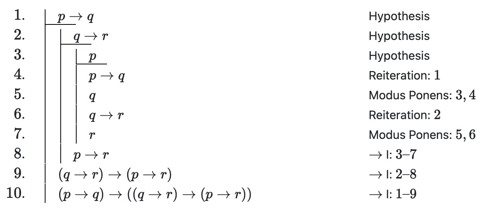
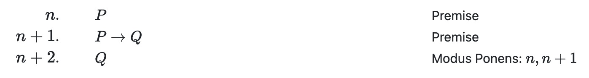

# lproof Extension for Quarto

This extension provides support for HTML and LaTeX rendering of object-language proofs (lproofs) in
quarto markdown.

## Installation

The following command will install the extension under the `_extensions` subdirectory of your quarto
project.

```sh
quarto add https://github.com/anubav/lproof/archive/refs/heads/main.zip
```

To enable the extension in your quarto project, add `lproof` to the list of filters in your
\_quarto.yml file or document front matter.

```
---
title: Quarto Document
filters:
   - lproof
   ...
---
```

## Basic Usage

Object-language proofs (lproofs) are delimited within a fenced
[div](https://quarto.org/docs/authoring/markdown-basics.html#divs-and-spans) block assigned the custom
class `.lproof`. Every line of text in the block must be indented (at least) four spaces (or one
tab) so as to ensure that quarto reads the text
[verbatim](https://pandoc.org/chunkedhtml-demo/8.5-verbatim-code-blocks.html). Apart from this
requirement any space between elements is ignored and should be utilized to improve readability.

### Sequential Proofs

The most basic lproof is simply a sequence of numbered lines (formatted like a markdown [ordered list](https://quarto.org/docs/authoring/markdown-basics.html#lists)), each of which
contains the formula appearing on that line of the proof followed by an optional justification
for that line enclosed within square brackets (`[` and `]`):

```
::: {.lproof} :::

    1. P                  [Premise]
    2. P\rightarrow Q     [Premise]
    3. Q                  [Modus Ponens: 1, 2]

:::
```

All formulas are automatically formatted in math-mode.
When written to HTML this proof is rendered as follows:


### Fitch-Style Proofs

The lproof extension also allows for the formatting of Fitch-style proofs. To represent such proofs, vertical line symbols (`|`) are used to indicate
the depth of the subproof in which a line occurs and underscores (`_`) are used to mark new hypotheses
initiating subproofs.

```
::: {.lproof} :::

    1.  |_ p\rightarrow q                                                           [Hypothesis]
    2.  | |_ q\rightarrow r                                                         [Hypothesis]
    3.  | | |_ p                                                                    [Hypothesis]
    4.  | | |  p\rightarrow q                                                       [Reiteration: 1]
    5.  | | |  q                                                                    [Modus Ponens: 3, 4]
    6.  | | |  q\rightarrow r                                                       [Reiteration: 2]
    7.  | | |  r                                                                    [Modus Ponens: 5, 6]
    8.  | |  p\rightarrow r                                                         [$\rightarrow$ I: 3--7]
    9.  |  (q\rightarrow r)\rightarrow(p\rightarrow r)                              [$\rightarrow$ I: 2--8]
    10. |  (p\rightarrow q)\rightarrow((q\rightarrow r)\rightarrow(p\rightarrow r)) [$\rightarrow$ I: 1--9]

:::
```

This Fitch-style proof is rendered as follows:



### Gentzen-style Proof Trees [TODO]

## Formatting Options

### Line Number Labeling [TODO]

All line numbers are read as strings to be rendered in math-mode. Thus, any arbitrary math
expression can be used in place of a line number, e.g.:

```
::: {.lproof} :::

    n.   P                  [Premise]
    n+1. P\rightarrow Q     [Premise]
    n+2. Q                  [Modus Ponens: n, n+1]

:::
```



### Ellipses [TODO]

Ellipses may separate lines in an lproof to indicate an implied interpolation. For example:

### Key Substitutions [TODO]

### `as-math` Class

It is often the case that every formula in a proof is to be rendered in math-mode. In such cases,
instead of explicitly enforcing math-mode rendering by enclosing each formula within dollar signs
`$...$`, we can have all formulas render in math-mode automatically by adding to the containing div
block the additional class `.as-math`:

```
::: {.lproof .as-math} :::

    1.  |_  p\rightarrow q
    2.  | |_  q\rightarrow r
    3.  | | |_  p
    4.  | | |   p\rightarrow q                                                        [Reiteration: 1]
    5.  | | |   q                                                                     [Modus Ponens: 3, 4]
    6.  | | |   q\rightarrow r                                                        [Reiteration: 2]
    7.  | | |   r                                                                     [Modus Ponens: 5, 6]
    8.  | |   p\rightarrow r                                                          [$\rightarrow$I: 3-7]
    9.  |   (q\rightarrow r)\rightarrow (p\rightarrow r)                              [$\rightarrow$I: 2-8]
    10.   (p\rightarrow q)\rightarrow((q\rightarrow r)\rightarrow (p\rightarrow r))   [$\rightarrow$I:1-9]

:::
```

Math-mode must still be explicitly enforced in the line numbers and justifications for each
line of the proof.

## Customization

### CSS Styling of lproofs
