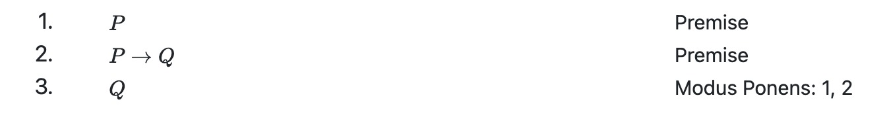

# lproof Extension for Quarto

This extension provides support for HTML and LaTeX rendering of object-language proofs (lproofs) in
quarto markdown.

## Installation

The following command will install the extension under the `_extensions` subdirectory of your quarto
project.

```sh
quarto add https://github.com/anubav/lproof/archive/refs/heads/main.zip
```

To enable the extension in your quarto project, add `lproof` to the list of filters in your
\_quarto.yml file or your document front matter.

```
---
title: Quarto Document
filters:
   - lproof
   ...
---
```

### Usage

Object Language proofs are delimited within a fenced
[div](https://quarto.org/docs/authoring/markdown-basics.html#divs-and-spans) block with the custom
class `.olproof`. Every line of text in the block must be indented (at least) four spaces (or one
tab) so as to ensure that quarto reads the text
[verbatim](https://pandoc.org/chunkedhtml-demo/8.5-verbatim-code-blocks.html). Apart from this
requirement any space between elements in an lproof is ignored and ought to be utilized to improve readability.

#### Sequential Proofs

The most basic lproof is simply a sequence of numbered lines (formatted like a markdown [ordered list](https://quarto.org/docs/authoring/markdown-basics.html#lists)), each of which
contains text corresponding to the content of that line of the proof followed by an optional justification
for that line given by text enclosed within square brackets (`[` and `]`). For example:

```
::: {.lproof} :::

    1. $P$                  [Premise]
    2. $P\rightarrow Q$     [Premise]
    3. $Q$                  [Modus Ponens: 1, 2]

:::
```

When written to HTML this proof is rendered as follows:



#### Fitch-Style Proofs

An lproof may also be formatted as a Fitch-style proof, where vertical line symbols (`|`) are used to
indicate the depth of a line and underscores (`_`) are used to mark new hypotheses.

```
::: {.lproof} :::

    1. |_   $P \rightarrow Q$
    2. | |_ $\neg Q$
    3. | | |_ $P$
    4. | | |  $Q$
    5. | | |  $\bot$                    [Modus Ponens: 2, 4]
    6. | | $\neg P$                     [$\neg E$: 3-5]
    7. | $\neg Q \rightarrow \neg P$    [$\rightarrow I$: 2-6]

:::
```
